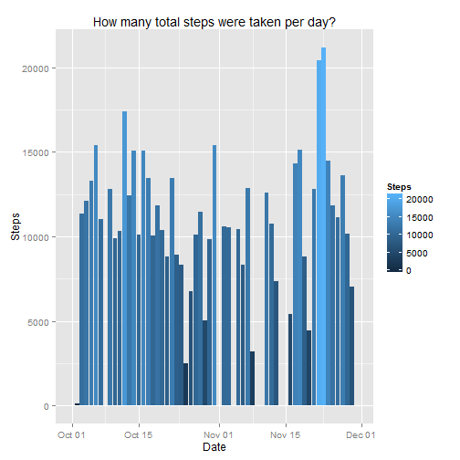

## Loading and preprocessing the data

First, set global options for the markdown file:


Second, call on the two libraries we will use for the remainder of the analysis:

```r
library(dplyr)
```

```
## 
## Attaching package: 'dplyr'
```

```
## The following objects are masked from 'package:stats':
## 
##     filter, lag
```

```
## The following objects are masked from 'package:base':
## 
##     intersect, setdiff, setequal, union
```

```r
library(ggplot2)
```

Finally, read the data from the zip file in this repository. Convert the date field to the necessary date format. Viewing this data, we can see the number of rows and ascertain that the date conversion has worked correctly:

```r
unzip("activity.zip")
activity<-read.csv("activity.csv")
activity$date<-as.Date(activity$date,"%Y-%m-%d")
str(activity)
```

```
## 'data.frame':	17568 obs. of  3 variables:
##  $ steps   : int  NA NA NA NA NA NA NA NA NA NA ...
##  $ date    : Date, format: "2012-10-01" "2012-10-01" ...
##  $ interval: int  0 5 10 15 20 25 30 35 40 45 ...
```

## What is mean total number of steps taken per day?

#### 1) Calculate the total number of steps taken per day

Group the data frame by date to get total steps by date. If we view this table data frame, we can see that it's done this correctly as there are now 61 rows, one for each date:

```r
act_by_date<-activity%>%
        group_by(date)%>%
        summarize(sum(steps,na.rm=TRUE))
names(act_by_date)<-c("Date","Steps")
act_by_date
```

```
## Source: local data frame [61 x 2]
## 
##          Date Steps
##        (date) (int)
## 1  2012-10-01     0
## 2  2012-10-02   126
## 3  2012-10-03 11352
## 4  2012-10-04 12116
## 5  2012-10-05 13294
## 6  2012-10-06 15420
## 7  2012-10-07 11015
## 8  2012-10-08     0
## 9  2012-10-09 12811
## 10 2012-10-10  9900
## ..        ...   ...
```

#### 2) Create histogram based on total steps per day

Create a plot of Date x Steps. I have made the fill of the histogram become lighter the higher the number of steps to quickly pull high and low values:

```r
ggplot(act_by_date,aes(x=Date,y=Steps))+
        geom_histogram(stat="identity",aes(fill=Steps))+
        labs(title="How many total steps were taken per day?")
```



#### 3) Calculate and return the mean and median of total steps per day

Return mean and median of the Steps column of the data frame:

```r
mean(act_by_date$Steps)
```

```
## [1] 9354.23
```

```r
median(act_by_date$Steps)
```

```
## [1] 10395
```

## What is the average daily activity pattern?

#### 1) Make a time series plot of the 5-minute interval (x) and the average number of steps taken, averaged across all days (y)

First, group data frame by interval, then average the number of steps by interval. If we view this table data frame, we can see that the summarization worked: there are 288 total intervals in a day, which corresponds with the number of rows:

```r
steps_by_int<-activity%>%
        group_by(interval)%>%
        summarize(mean(steps,na.rm=TRUE))
names(steps_by_int)<-c("Interval","Steps")
steps_by_int
```

```
## Source: local data frame [288 x 2]
## 
##    Interval     Steps
##       (int)     (dbl)
## 1         0 1.7169811
## 2         5 0.3396226
## 3        10 0.1320755
## 4        15 0.1509434
## 5        20 0.0754717
## 6        25 2.0943396
## 7        30 0.5283019
## 8        35 0.8679245
## 9        40 0.0000000
## 10       45 1.4716981
## ..      ...       ...
```

Second, make the line graph based on this grouped data frame:

```r
ggplot(steps_by_int,aes(x=Interval,y=Steps))+
        geom_line(stat="identity")+
        labs(y="Average steps",title="What is the average step count by interval?")
```


#### 2) Which 5-minute interval contains the maximum number of steps?

Calculate and return the interval with the greatest number of steps. This function also returns the number of steps that is that maximum number. Based on the peak of the previous line graph, this average step count seems accurate:

```r
top_n(steps_by_int,1,Steps)
```

```
## Source: local data frame [1 x 2]
## 
##   Interval    Steps
##      (int)    (dbl)
## 1      835 206.1698
```

## Imputing missing values

#### 1) Calculate and report the total number of missing values

I believe only the "steps" field has missing values, but we will check to make sure:

```r
sum(is.na(activity$steps))
```

```
## [1] 2304
```

```r
sum(is.na(activity$date))
```

```
## [1] 0
```

```r
sum(is.na(activity$interval))
```

```
## [1] 0
```
Looks like "steps" is the only field with NAs. This will be useful as we create a function to impute new values.

#### 2) Devise a strategy for filling in all the missing values in the dataset; create a new dataset with the missing values filled in

I am going to use average step count by interval because I feel that will be the most accurate info to impute (based on the previous graph "What is the average step count by interval?", there are extremely few steps taken from intervals 0-500, and it would be foolish to simply insert the average step count across all intervals into those NAs). 

The mutate and ifelse functions are used to replace NA values with average step count by interval number. Using is.na, we can see that this function worked and there are no NA values:

```r
imputed<-activity%>%
        group_by(interval)%>%
        mutate(steps=ifelse(is.na(steps),mean(steps,na.rm=TRUE),steps))
sum(is.na(imputed$steps))
```

```
## [1] 0
```

#### 3) Make a histogram of the total steps taken each day; calculate mean and median of total steps taken per day. Do the values differ from the first part of the assignment, and what is the impact of imputing missing data?

First, create a histogram of total steps taken each day. To do an apt comparison, I am using the same formatting as the previous histogram (without imputed data):

```r
imputed_by_date<-imputed%>%
        group_by(date)%>%
        summarize(sum(steps))
names(imputed_by_date)<-c("Date","Steps")
```

Here is the histogram:

```r
ggplot(imputed_by_date,aes(x=Date,y=Steps))+
        geom_histogram(stat="identity",aes(fill=Steps))+
        labs(title="How many total steps were taken per day (using imputed data)?")
```


Second, return the mean and median of total steps taken per day:

```r
mean(imputed_by_date$Steps)
```

```
## [1] 10766.19
```

```r
median(imputed_by_date$Steps)
```

```
## [1] 10766.19
```

Finally, return the percentage difference between the mean imputed step count and non-imputed step count:

```r
sum((mean(imputed_by_date$Steps)-mean(act_by_date$Steps))/mean(imputed_by_date$Steps))
```

```
## [1] 0.1311475
```

```r
sum((median(imputed_by_date$Steps)-median(act_by_date$Steps))/median(imputed_by_date$Steps))
```

```
## [1] 0.03447726
```

As we can see from the sums, imputing values makes a difference (but not a huge one) on median daily step count, and a slightly larger impact on the mean daily step count. 

If we compare the two charts, imputing values has a large impact on some days (with high count of NAs) but a small impact on others. This is only to be expected.

Based on these findings, I would conclude that it's perfectly accurate to impute NAs based on average step count by interval. There are still low points of the graph (inactive days), so it's not like we're overestimating this subject's activity, and the median step count by day isn't affected that much.

## Are there differences in activity patterns between weekdays and weekends?

#### 1) Create a new factor variable in the dataset for weekends vs weekdays

This is done using mutate and ifelse. To prepare to make a graph, I've further grouped and summarized the data based on type and interval. As we can see by viewing the data, the number of rows is 576 (double the initial interval count of 288):

```r
act_daytypes<-activity%>%
        mutate(type=ifelse(weekdays(date)=="Saturday"|
                                   weekdays(date)=="Sunday",
                           "Weekend","Weekday"))%>%
        group_by(type,interval)%>%
        summarize(mean(steps,na.rm=TRUE))
names(act_daytypes)<-c("Type","Interval","Steps")
act_daytypes
```

```
## Source: local data frame [576 x 3]
## Groups: type [?]
## 
##       Type Interval     Steps
##      (chr)    (int)     (dbl)
## 1  Weekday        0 2.3333333
## 2  Weekday        5 0.4615385
## 3  Weekday       10 0.1794872
## 4  Weekday       15 0.2051282
## 5  Weekday       20 0.1025641
## 6  Weekday       25 1.5128205
## 7  Weekday       30 0.7179487
## 8  Weekday       35 1.1794872
## 9  Weekday       40 0.0000000
## 10 Weekday       45 1.8461538
## ..     ...      ...       ...
```

#### 2) Make a panel plot containing the avg number of steps per 5 minute interval, by weekend vs weekday

To compare this to the previous line graph, I am using similar formatting:

```r
par(mfrow=c(2,1),mar=c(4,4,4,2))
ggplot(act_daytypes,aes(x=Interval,y=Steps))+
        geom_line(stat="identity")+
        facet_grid(Type~.)+
        labs(y="Average steps",
             title="What is the average step count by interval (weekday vs weekend)?")
```


To answer this question, yes there are some distinct differences. This subject clearly has routines based on weekend vs weekday. I'd guess s/he has a desk job based on high levels of inactivity between two main peaks in the morning and evening, and is generally active during the weekend.
